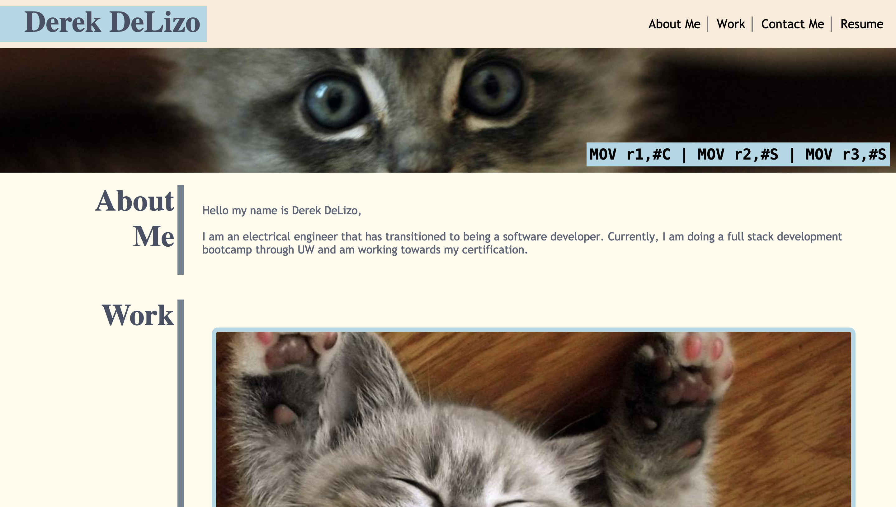
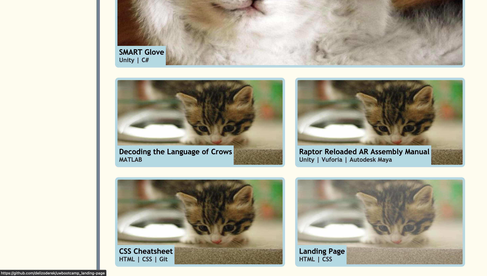
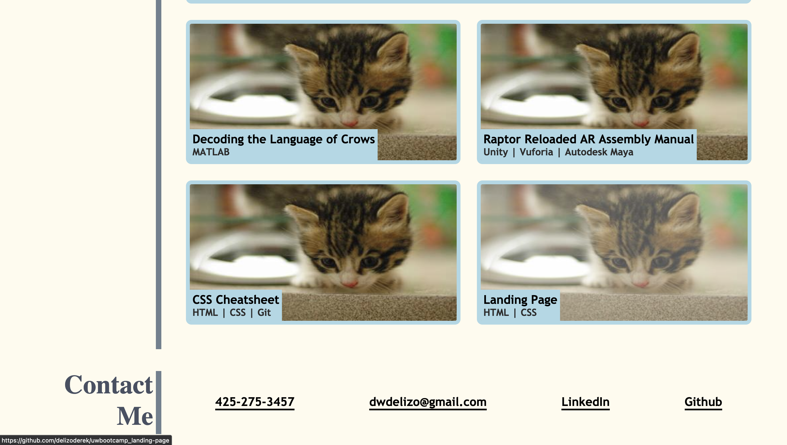
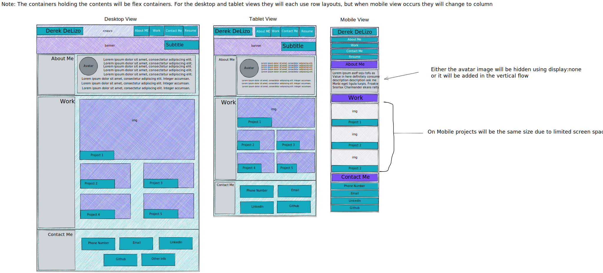

# delizoderek.github.io

The goal of this assignment was to setup a portfolio page that shows off the projects we have worked on. The site needed to be created using HTML and CSS, specifically using the flexbox selector that was added in css3

## Resources
- [Excalidraw](https://excalidraw.com/)
- [Mozilla Developer Network](https://developer.mozilla.org/en-US/docs/Web/CSS/:last-child)
- [W3Schools](https://www.w3schools.com/Css/css_link.asp)
- [A Complete Guide to Flexbox](https://css-tricks.com/snippets/css/a-guide-to-flexbox/)
- [HTML5 Doctor Sectioning Flowchart](http://html5doctor.com/downloads/h5d-sectioning-flowchart.pdf)
- [HTML for Subheadings and Headings](https://css-tricks.com/html-for-subheadings-and-headings/)
- [ColorsWall](https://colorswall.com/)

## [Portfolio Page](delizoderek.github.io)

## My Wireframe
Here is the wireframe I used to initially mockup the website.

